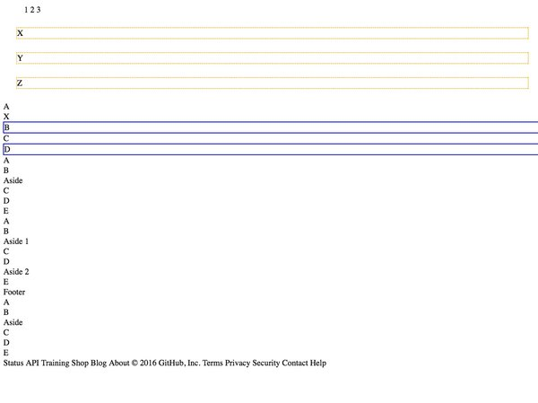

# Pseudoclasses Exercise

**Author**: Megan Ford April 2016 


Created as a student exercise as part of Nashville Software School's Front End Bootcamp curriculum. Please see below for fulfilled requirements: this exercise is not meant to be a finished production app or indication of current skills, but rather a demonstration of skills learned and utilized at the time of creation.


Any/all images are for educational/example purposes only and are all rights reserved original owners. 


## Instructions


NSS Front-End Milestone 1 (Static Web) Exercise 8: 


[Requirements For Project](https://github.com/nashville-software-school/front-end-milestones/blob/master/2-the-static-web/exercises/SW_CSS_PSEUDOCLASSES.md)


## Install


``` 
git clone https://github.com/MeganCFord/NSS-SW-8-Pseudoclasses.git
cd 5-selectors
open index.html
```

[Live Site On Github](http://megancford.github.io/NSS-SW-8-Pseudoclasses)





## License 


[MIT license](LICENSE.md)

